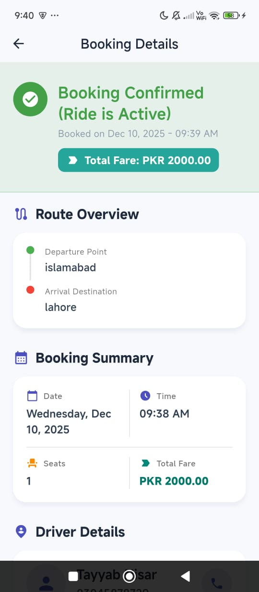
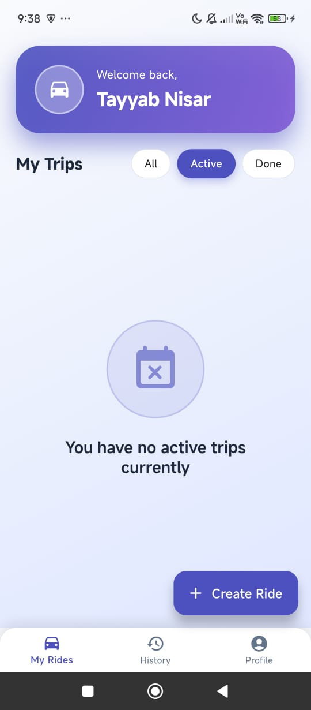
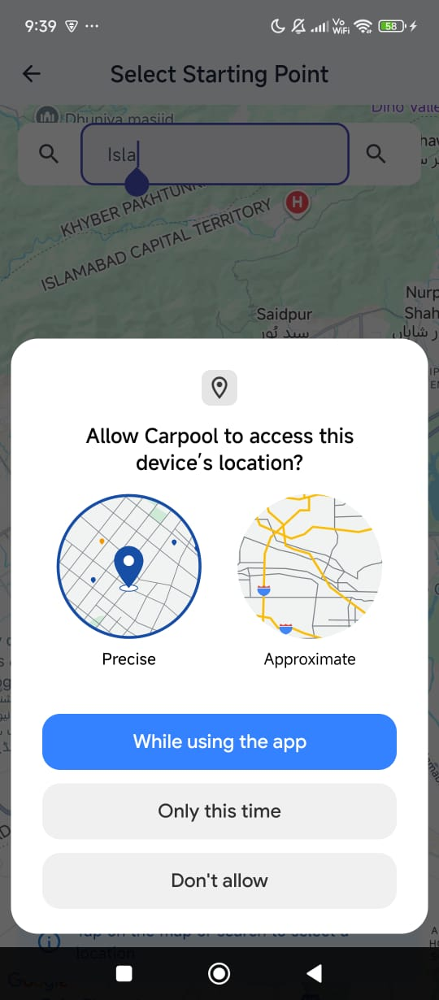
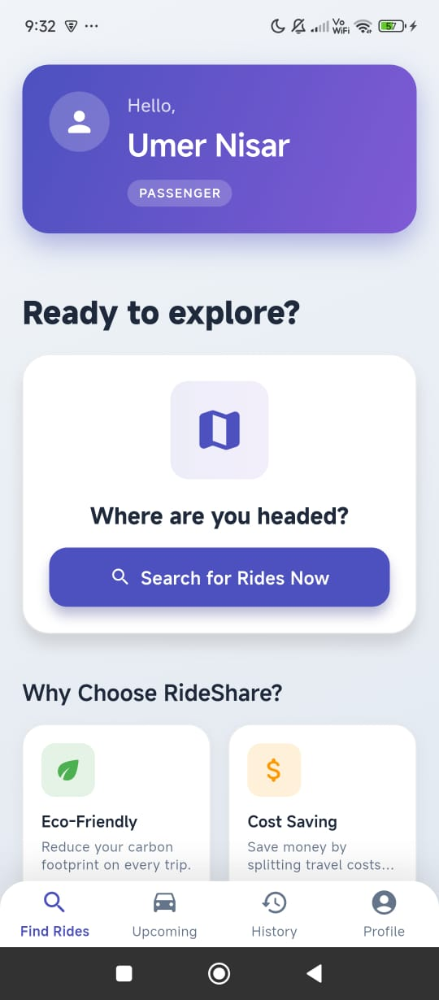
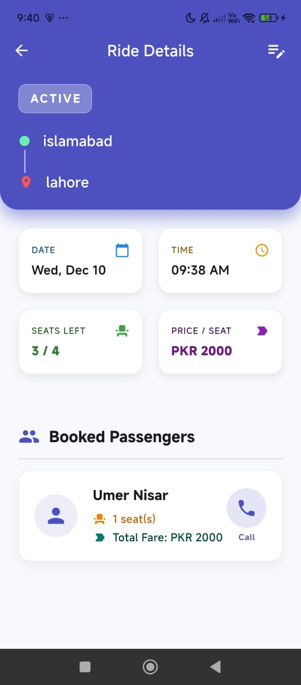
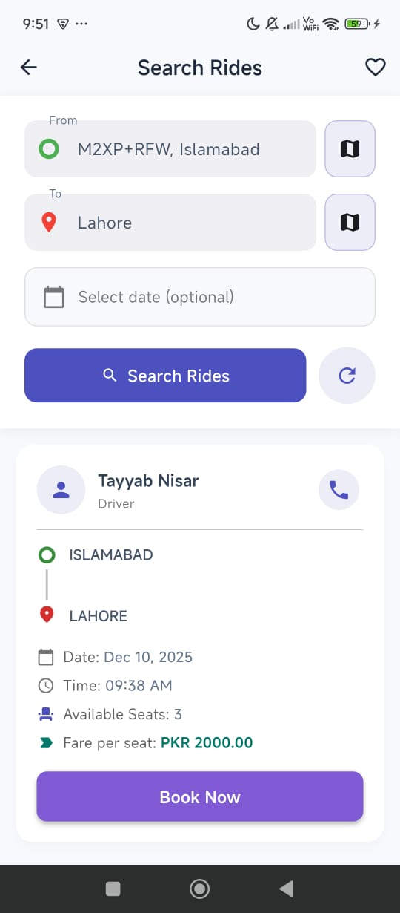
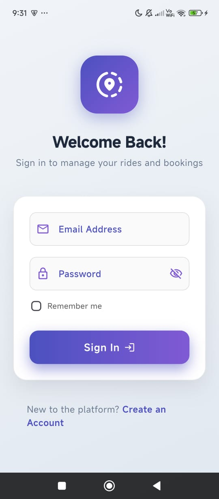
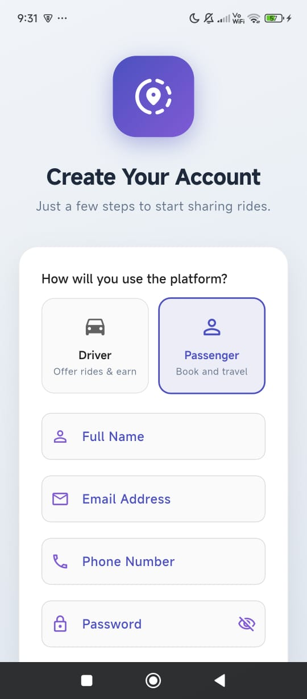

# Carpool

Carpool is a Flutter mobile app that helps people share rides easily and save money. It connects drivers and passengers going the same way to reduce travel costs and traffic.

## About The Project

Carpool is built using Flutter and Android Studio, with Firebase for user authentication and real-time database features. Users can sign up, create rides, search for rides, join rides, and see ride details.

The app aims to make daily travel more affordable, social, and eco-friendly by connecting people with similar travel routes in a simple and friendly way.

## Features

- User registration and login with Firebase Authentication
- Create new carpool rides
- Search and join available rides
- View ride details such as route, time, seats, and cost
- Simple and clean user interface

## Technologies Used

- Flutter (Dart)
- Android Studio
- Firebase Authentication and Firestore
- Google Maps API (for showing routes)

## Getting Started

If you want to run this project locally:

1. Clone the repository
2. Open the project in Android Studio
3. Run `flutter pub get` to install dependencies
4. Add your Google Maps API key in `android/local.properties` as:

MAPS_API_KEY=your_actual_google_maps_api_key_here

5. Connect an Android device or emulator
6. Run the app

## Screenshots

## Important

- The Google Maps API key is **NOT included** in this repo for security reasons.
- Please create `android/local.properties` with your own API key as shown above.